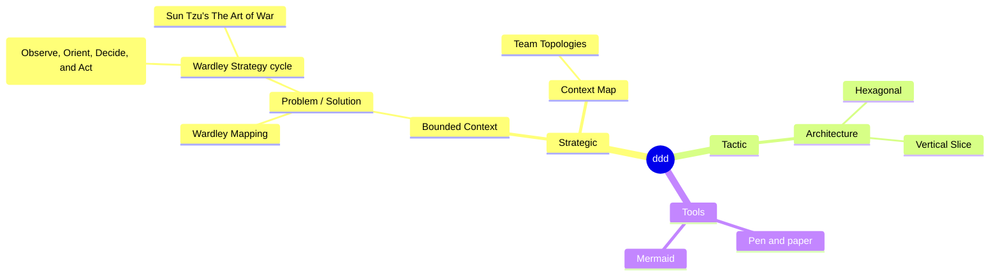

```mermaid
mindmap
  root((ddd))
    Strategic
      Bounded Context
        Problem / Solution
          Wardley Mapping
          Wardley Strategy cycle
            John Boyd's OODA loop (Observe, Orient, Decide, and Act)
            Sun Tzu's The Art of War
      
      Context Map
        Team Topologies
    Tactic
      Architecture
        Hexagonal
        Vertical Slice
        
    Tools
      Pen and paper
      Mermaid
 
```
