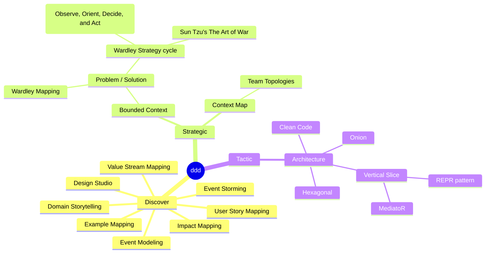

```mermaid
mindmap
  root((ddd))
    Discover
      Event Storming
      Example Mapping
      Value Stream Mapping
      User Story Mapping
      Design Studio
      Impact Mapping
      Domain Storytelling
      Event Modeling
    Strategic
      Bounded Context
        Problem / Solution
          Wardley Mapping
          Wardley Strategy cycle
            John Boyd's OODA loop (Observe, Orient, Decide, and Act)
            Sun Tzu's The Art of War
      
      Context Map
        Team Topologies
    Tactic
      Architecture
        Hexagonal
        Onion
        Clean Code
        Vertical Slice
          MediatoR
          REPR pattern
 
```
